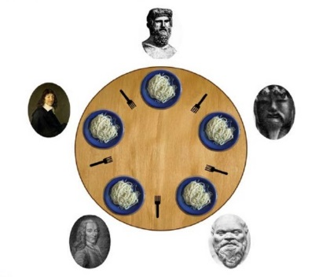

### 철학자들의 만찬 문제

5명의 철학자가 원탁에 앉아 있음
철학자들과 서로 말할 수 없음
양손에 포크를 잡아야 식사를 할 수 있음

각각의 철학자가 모두 왼쪽 포크를 들고 오른쪽 포크를 들 때 까지 기다리면, 무한정 기다리는 교착상태(Deadlock)에 빠지게 됨.
어떤 경우에는 동시에 두 포크를 잡을 수 없어 식사를 하지 못하는 철학자가 발생할 수 있음
