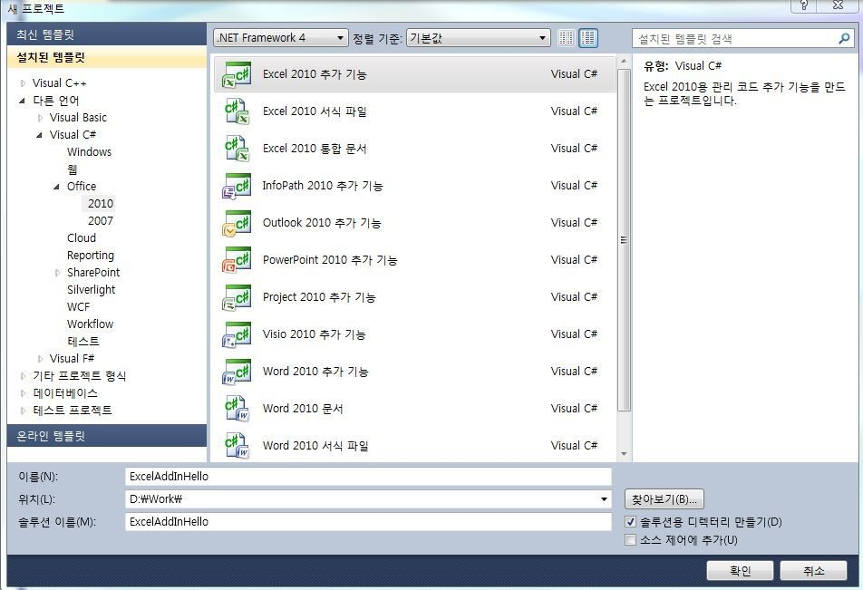
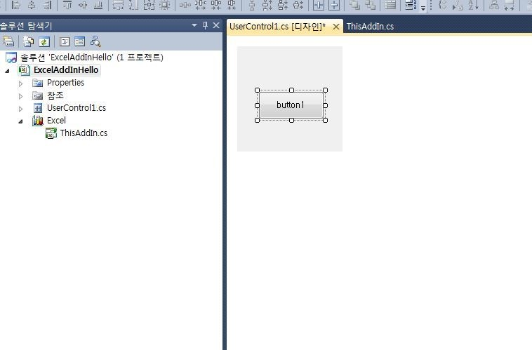
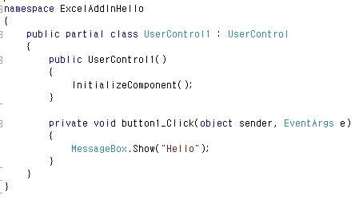
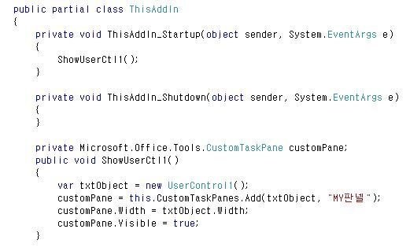

### Excel VSTO 예제
Excel 추가 기능이 필요하고 VSTO를 처음 개발하시는 분들을 위한 예제

> 개발툴 : Visual Studio 2010

> 언어 : C#

Visual Studio 2010 실행
새프로젝트-Visual C#-Office-2010 항목의 "Excel 2010 추가 기능" 선택하고 프로젝트 이름 넣고 프로젝트 생성

프로젝트명에 우클릭 추가-새항목 클릭
사용자 정의 컨트롤 선택후 추가
컨트롤 디자인 화면이 나오는데 도구상자에 있는 버튼을 하나 추가한다.

버튼을 더블 클릭해 버튼 클릭 함수를 정의해 준다.
처음 시작이므로 "Hello" 메시지를 보여주는 코드를 작성

Addin 시작 코드에 아래와 같이 판넬에 사용자 컨트롤을 붙여주는 코드 작성

프로젝트를 컴파일하고 게시하면 게시위치에 vsto파일이 생긴다
그 파일을 더블클릭해 설치하면 엑셀 실행시 해당 Addin이 로딩되어 실행된다.

Excel VSTO 개발을 처음 하시는 분들은 간단하게 예제를 따라 해보면서 이해하시면 좋을것 같습니다.
이상 VSTO 시작을 위한 간단한 코드 작성이었습니다.
